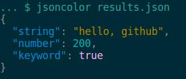

JSON Color
==========

.. image:: https://img.shields.io/pypi/v/jsoncolor.svg
    :target: https://pypi.python.org/pypi/jsoncolor
    :alt: Latest PyPI version

.. image:: https://travis-ci.org/json-transformations/jsoncolor.png
   :target: https://travis-ci.org/json-transformations/jsoncolor
   :alt: Latest Travis CI build status

A JSON content terminal coloring tool

Installation
------------
.. code-block:: console

  $ pip install jsoncolor

Usage
-----
.. code-block:: console

  $ jsoncolor --help

    Usage: jsoncolor [OPTIONS] [JSONFILE]

    JSON text coloring.

    Options:
      -c, --create        Create a new color style
      -d, --default TEXT  Set default color style
      -n, --nocolor       Disable syntax highlighting
      -s, --styles        Print all preset styles
      --version           Show the version and exit.
      --help              Show this message and exit.

Examples
--------
.. code-block:: console

  $ cat results.json
  {
    "string": "hello, github",
    "number": 200,
    "keyword": true
  }

  $ jsoncolor results.json

Create Color Styles
-------------------
* **jsoncolor** defaults to **solarized**, but you can create your own style.
* Modify the **jsoncolor** configuration file with hexadecimal color `codes <http://www.colorhexa.com/>`_.
* Configuration file is created with `jsonconfig <https://github.com/json-transformations/jsonconfig>`_
* Configuration files `locations <https://github.com/json-transformations/jsonconfig#configuration-file-locations>`_

Authors
-------
JSON Color was written by `Tim Phillips <phillipstr@gmail.com>`_.

Credits
-------
`Brian Peterson <https://github.com/bpeterso2000>`_, creator of `JSON Transformations <https://github.com/json-transformations>`_
